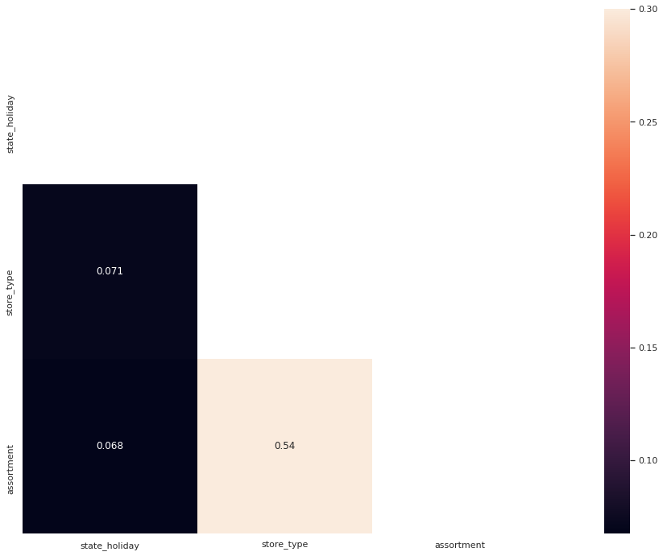

[](https://www.linkedin.com/in/gabrielhermsen/)
[](https://docs.python.org/3.9/)
[](http://perso.crans.org/besson/LICENSE.html)
[](https://github.com/ghermsen/airbnb_munchen/issues)

# Rossmann Stores Sale Prediction

Dirk Rossmann GmbH, commonly known as Rossmann, is the largest drugstore chain in Germany in the number of stores, with 2196 stores in German territory (2020, [Statista](https://www.statista.com/statistics/505614/number-of-drugstore-branches-germany/#:~:text=The%20German%20drugstore%20market%20is,Budni%2C%20was%20founded%20in%20Hamburg)). In 2015, Rossmann launched a competition on [Kaggle](https://www.kaggle.com/c/rossmann-store-sales/overview) to forecast sales in stores for the next six weeks.

This project will cover all the steps of a Data Science project from understanding the problem until the deployment of a solution as seen above, and it will predict the sale of a particular store in the next six weeks.

<br><center></center>
Photo by [Anakin81](https://commons.wikimedia.org/wiki/File:Rossmann_Schriftzug_mit_Centaur.jpg), [CC BY-SA 4.0](https://creativecommons.org/licenses/by-sa/4.0), via Wikimedia Commons

---

## Table of Contents
- [Project Methodology](#project-methodology)
- [01. The Problem and the Solution](#01-the-problem-and-the-solution)
- [02. Data Understanding and Data Preparation](#02-data-understanding-and-data-preparation)
- [03. Feature Engineering and Feature Filtering](#03-feature-engineering-and-feature-filtering)
- [04. Exploratory Data Analysis](04-exploratory-data-analysis)
- [05. Data Preprocessing](#05-data-preprocessing)
- [06. Feature Selection](#06-feature-selection)
- [07. Machine Learning Modeling](#07-machine-learning-modeling)
- [08. Hyperparameter Tuning](#08-hyperparameter-tuning)
- [09. Understanding the Error and Business Performance](#09-understanding-the-error-and-business-performance)
- [10. Final Model Deployment](#10-final-model-deployment)
- [11. The Final Solution](#11-the-final-solution)
- [Conclusion](#conclusion)

---

## Project Methodology
[(next section)](#01-the-problem-and-the-solution) | [Table of Contents](#table-of-contents)

The methodology used in this project is the **CRISP-DM** (Cross-Industry Standard Process for Data Mining), one of the most used methodologies in data science projects. In my opinion, the main advantages of using this methodology in data science projects (when compared to others SEMMA and KDD) are that any industry can use CRISP-DM on its projects and the agility in the generation of value.

This methodology is divided in six main phases, **business understanding, data understanding, data preparation, modeling, evaluation and deployment**, and when the six phases are completed a cycle of the CRISP-DM is done.

For a better understanding, we will assume the following situation: we are in the modeling phase of the project, and from our experience, it can be seen that the results can be better if a specific variable were created and implemented. However, the data preparation phase has already been completed, which makes the implementation of this new variable only happen in the second cycle of CRISP-DM. This method concludes the current cycle in less time and delivers value and knowledge at the end of each phase, automatically generating a list of future implementations for future cycles.

Below there is a diagram that shows this methodology:

<p align = "center">
    <center>
    <br><a href="https://commons.wikimedia.org/wiki/File:CRISP-DM_Process_Diagram.png">Photo by Kenneth Jensen</a>, <a href="https://creativecommons.org/licenses/by-sa/3.0">CC BY-SA 3.0</a>, via Wikimedia Commons
    </center>
</p> 

---

## 01. The Problem and the Solution
[(next section)](#02-data-understanding-and-data-preparation) | [(previous section)](#project-methodology) | [Table of Contents](#table-of-contents)

Here there is an understanding of the problem, and consequently, it is expected a delivery of value with a suggested solution. Analyzing the description of the competition in [Kaggle](https://www.kaggle.com/c/rossmann-store-sales), the following can be observed: * "With thousands of individual managers predicting sales based on their unique circumstances, the accuracy of results can be quite varied." *. With this mention, it seems that the problem lies in obtaining sales results with varying accuracy by these thousands of managers.

Thus, the project's objective is to create a machine learning model that can understand the factors that influence the sales of each store and generate forecasts following these factors.

---

## 02. Data Understanding and Data Preparation
[(next section)](#03-feature-engineering-and-feature-filtering) | [(previous section)](#01-the-problem-and-the-solution) | [Table of Contents](#table-of-contents)

### 02.01 - Obtaining the Data

All data used in this project is on the website of the [Kaggle](https://www.kaggle.com/c/rossmann-store-sales/data).

For this project, the following files were downloaded:

* Downloaded Files:
    * *train.csv* - historical data including Sales
    * *test.csv* - historical data excluding Sales
    * *store.csv* - supplemental information about the stores
    
* Github Repository
    * *train.csv* - [repository path](https://github.com/ghermsen/rossmann_prediction/blob/main/data/train.csv)
    * *test.csv* - [repository path](https://github.com/ghermsen/rossmann_prediction/blob/main/data/test.csv)
    * *store.csv* - [repository path](https://github.com/ghermsen/rossmann_prediction/blob/main/data/store.csv)
    
Após entender os dados foi criado um dataset `df_raw` unindo os datasets *train.csv* e *store.csv* com o seguinte código:

After understanding the data, a dataset `df_raw` was created merging the datasets *train.csv* and *store.csv* with the following code:

```python
# merging datasets

df_raw = pd.merge(df_sales_raw, df_store_raw, how = 'left', on = 'Store')
```

### 02.02 - Data Dimensions and Type of Variables

Below, it is possible to see that our dataset has **1,017,209 rows and 18 columns** as well as the type of its variables:

```python
# dataset's size

print(f'Number of rows:\t\t {df1.shape[0]}')
print(f'Number of columns:\t {df1.shape[1]}')

    Number of rows:    1017209
    Number of columns:      18
    
# type of variables

df1.dtypes

    store                             int64
    day_of_week                       int64
    date                             object
    sales                             int64
    customers                         int64
    open                              int64
    promo                             int64
    state_holiday                    object
    school_holiday                    int64
    store_type                       object
    assortment                       object
    competition_distance            float64
    competition_open_since_month    float64
    competition_open_since_year     float64
    promo2                            int64
    promo2_since_week               float64
    promo2_since_year               float64
    promo_interval                   object
    
    dtype: object
```

It can be observed that the variable `date` is an object. As this variable represent time, this variable passed for a process of transformation to `datetime64[ns]`.

```python 
# transforming date to datetime

df1['date'] = pd.to_datetime(df1['date'])
df1.dtypes

    store                                    int64
    day_of_week                              int64
    date                            datetime64[ns]
    sales                                    int64
    customers                                int64
    open                                     int64
    promo                                    int64
    state_holiday                           object
    school_holiday                           int64
    store_type                              object
    assortment                              object
    competition_distance                   float64
    competition_open_since_month           float64
    competition_open_since_year            float64
    promo2                                   int64
    promo2_since_week                      float64
    promo2_since_year                      float64
    promo_interval                          object
    dtype: object
```

### 02.03 - Checking NA's and Filling Out NA's

The quality of a dataset is directly related to the number of missing values. It is important to understand early on whether these null values are significant concerning the total number of entries to avoid future problems in our analysis. Below, it is possible to see that the following variables present missing data:

* `competition_distance` = &nbsp;&nbsp;&nbsp;&nbsp;&nbsp;&nbsp;&nbsp;&nbsp;&nbsp;&nbsp;&nbsp;&nbsp;&nbsp;&nbsp;2,642 or **00.26%**
* `competition_open_since_month` = 323,348 or **31.79%**
* `competition_open_since_month` = 323,348 or **31.79%**
* `competition_open_since_month` = 508,031 or **49.94%**
* `competition_open_since_month` = 508,031 or **49.94%**
* `competition_open_since_month` = 508,031 or **49.94%**

```python 
# checking na's

df1.isna().sum().sort_values()

    store                                0
    promo2                               0
    assortment                           0
    store_type                           0
    state_holiday                        0
    promo                                0
    school_holiday                       0
    customers                            0
    sales                                0
    date                                 0
    day_of_week                          0
    open                                 0
    competition_distance              2642
    competition_open_since_month    323348
    competition_open_since_year     323348
    promo2_since_year               508031
    promo2_since_week               508031
    promo_interval                  508031
    
    dtype: int64
```

Above, it is seen that the variable `competition_distance` shows missing values that are not significant for the analysis. These missing values could be deleted as there would be no significant problems in developing the project. However, thinking about the business, the dictionary of variables shows that this variable represents the *distance in meters to the nearest competitor store*. In this way, we can fill these values with a value much greater than the maximum value of the largest competition in existence. For this, we will consider 2x the maximum value of the competition.

```python 
# filling out competition_distance

max_value = df1['competition_distance'].max()

df1['competition_distance'] = df1['competition_distance'].apply(lambda x: max_value * 2 if math.isnan(x) else x)
```

The variables `competition_open_since_month` and` competition_open_since_year` have similar logic. Analyzing the variable's description in the variable dictionary, we see that they *gives the approximate year and month of the time the nearest competitor was opened*. There are two reasons why this variable has missing values, or this store does not have a close competitor, so there is no opening date for this competition, and the other reason is that there is a competitor. However, we do not know when this competition started, and to replace these NA's, the following assumption will be made. If the value is NA, the date of the respective sale (in year and month) will be copied to replace, since from that month and year it can be filtered in future dates if there is a competitor and this affected the sales of a particular store.

```python 
# filling out competition_open_since_month

df1['competition_open_since_month'] = df1.apply(lambda x: x['date'].month if math.isnan(x['competition_open_since_month']) 
                                                else x['competition_open_since_month'], axis = 1)

# filling out competition_open_since_year 

df1['competition_open_since_year'] = df1.apply(lambda x: x['date'].year if math.isnan(x['competition_open_since_year']) 
                                               else x['competition_open_since_year'], axis = 1)
```

The variables `promo2_since_year` and `promo2_since_week` have similar logic. Analyzing the variable's description in the variable dictionary, we see that they *describes the year and calendar week when the store started participating in Promo2*, where *Promo2* is a continuation of a promotion that some stores have joined where zero represents that the store is not participating. One means that the store is participating. If the value shows NA, it shows that the store is not participating in *Promo2*. For this, the same logic of filling NA values in the variables `competition_open_since_month` and `competition_open_since_year` will be applied.

```python 
# filling out promo2_since_week  

df1['promo2_since_week'] = df1.apply(lambda x: x['date'].week if math.isnan(x['promo2_since_week']) 
                                     else x['promo2_since_week'], axis = 1)

# filling out promo2_since_year

df1['promo2_since_year'] = df1.apply(lambda x: x['date'].year if math.isnan(x['promo2_since_year']) 
                                     else x['promo2_since_year'], axis = 1)
```

The variable `promo_interval` *describes the consecutive intervals Promo2 is started, naming the months the promotion is started anew. E.g. "Feb,May,Aug,Nov" means each round starts in February, May, August, November of any given year for that store*. This interval shows which months *Promo2* was active in the store. To replace the NA's, a dictionary mapping the months will be created. After this process, all the NA's values of the variable `promo_interval` will be replaced by zero. After this process, a new column called` month_map` is created, and it will receive the value of the month that the sale was carried out being mapped by the created dictionary. To conclude this process, a new column called `is_promo` is created to receive values zero and one, where zero means that the sale was made outside the promotion interval and one that the sale was made during the store's promotion interval.

```python 
# fillin out promo_interval           

# creating the dictionary month_map
month_map = {1:'Jan',
             2:'Feb',
             3:'Mar',
             4:'Apr',
             5:'Mai',
             6:'Jun',
             7:'Jul',
             8:'Aug',
             9:'Sep',
             10:'Oct',
             11:'Nov',
             12:'Dec'}

# filling out NA's with 0 in promo_interval
df1['promo_interval'].fillna(0, inplace = True)

# mapping the name of the month
df1['month_map'] = df1['date'].dt.month.map(month_map)

# creating a column to identify if in this date the store was in the promo interval or not
df1['is_promo'] = df1[['promo_interval', 'month_map']].apply(lambda x: 0 if x['promo_interval'] == 0 
                                                             else 1 if x['month_map'] in x['promo_interval'].split(',') 
                                                             else 0, axis = 1)
```

After these processes, all the NA's were filled out.

```python 
df1.isna().sum()

    store                           0
    day_of_week                     0
    date                            0
    sales                           0
    customers                       0
    open                            0
    promo                           0
    state_holiday                   0
    school_holiday                  0
    store_type                      0
    assortment                      0
    competition_distance            0
    competition_open_since_month    0
    competition_open_since_year     0
    promo2                          0
    promo2_since_week               0
    promo2_since_year               0
    promo_interval                  0
    month_map                       0
    is_promo                        0
    
    dtype: int64
    
# changing variables type

df1['competition_open_since_month'] = df1['competition_open_since_month'].astype(int)

df1['competition_open_since_year'] = df1['competition_open_since_year'].astype(int)

df1['promo2_since_week'] = df1['promo2_since_week'].astype(int)

df1['promo2_since_year'] = df1['promo2_since_year'].astype(int)
```

### 02.04 - Descriptive Statistics

Descriptive statistics will provide knowledge of the business and enable the detection of some errors. Descriptive statistics is composed of two types of metrics, the metrics of central tendency and dispersion. 

#### 02.04.01 - Numerical Attributes

The descriptive statistics shows that the average sales is **5,773.82 €**, very close to the median of **5,744.00 €**. We can also see that the average number of customers in stores is **633.14** with a standard deviation of **464**. In other words, there are days that the stores can receive more than 1000 customers and days that stores receive less than 200 customers.

<p align="center">
    
</p>

#### 02.04.02 - Categorical Attributes

One of the most practical ways to do descriptive statistics for categorical variables is using the *boxplot* graph. This graph shows us the maximum and minimum values, represented by the upper and lower horizontal lines. The first and third quartiles are represented by the upper and lower lines from the boxes and the median, the central line in each box.

There is the possibility of identifying outliers with these graphs, represented by the points above or below the lines representing the maximum and minimum.

Once plotted, we can see the relationship between categorical variables and sales. We can see that the median of the `state_holiday` type b (Easter Holiday) and type c (Christmas) are greater than type a (Public Holiday). The `store_type` b has the highest median followed by c, and stores with `assortment` b (extra) have the highest median.

<p align="center">
    
</p>

---

## 03. Feature Engineering and Feature Filtering
[(next section)](#04-exploratory-data-analysis) | [(previous section)](#02-data-understanding-and-data-preparation) | [Table of Contents](#table-of-contents)

In this stage of the project, variables will be created from existing variables. For this, a hypothesis map was generated to assist which variables must be created in order to accept the hypotheses.

### 03.01 - Hypothesis Map and Hyphothesis Creation

The Hypothesis Map was developed following five main factors that could influence the daily sales: **customers characteristics, products characteristics, location characteristics, stores characteristics, and time characteristics**.

<p align="center">
    
</p>

Based on these characteristics and the data available on the dataset, the following list of hypotheses were developed:

- 1. Stores with a larger assortment should sell more.
- 2. Stores with closer competitors should sell less.
- 3. Stores with longer competitors should sell more.
- 4. Stores with active promotions for longer should sell more.
- 5. Stores with more days of promotion should sell more.
- 6. Stores with more consecutive promotions should sell more.
- 7. Stores open during the Christmas holiday should sell more.
- 8. Stores should sell more over the years.
- 9. Stores should sell more in the second half of the year.
- 10. Stores should sell more after the 10th of each month.
- 11. Stores should sell less on weekends.
- 12. Stores should sell less during school holidays.

### 03.02 - Feature Engineering

According with the final hypothesis list, the following variables were created or modified:

| Variable | Description |
| ----- | ----- |
| `year` | year of the observation |
| `month` | month of the observation |
| `day` | day of the observation |
| `week_of_year` | week of the year of the observation |
| `year_week` | year and week of the observation |
| `competition_since` | date that started a competition close to the store |
| `competition_time_month` | period in months that there is this competition close to the store |
| `promo_since` | date that the store joined a promotion  |
| `promo_time_week` | period in weeks that the store joined a promotion |
| `assortment` | modification of the variable with the correct assortment |
| `state_holiday` | modification of the variable with the correct holiday name |

```python 
# year

df2['year'] = df2['date'].dt.year

# month

df2['month'] = df2['date'].dt.month

# day

df2['day'] = df2['date'].dt.day

# week_of_year

df2['week_of_year'] = df2['date'].dt.weekofyear

# year_week

df2['year_week'] = df2['date'].dt.strftime('%Y-%W')

# competition_since

df2['competition_since'] = df2.apply(lambda x: datetime.datetime(year = x['competition_open_since_year'], month = x['competition_open_since_month'], day = 1), axis = 1)
df2['competition_time_month'] = ((df2['date'] - df2['competition_since']) / 30).apply(lambda x: x.days).astype(int)

# promo_since

df2['promo_since'] = df2['promo2_since_year'].astype(str) + '-' + df2['promo2_since_week'].astype(str)
df2['promo_since'] = df2['promo_since'].apply(lambda x: datetime.datetime.strptime(x + '-1', '%Y-%W-%w') - datetime.timedelta(days = 7))
df2['promo_time_week'] = ((df2['date'] - df2['promo_since']) / 7).apply(lambda x: x.days).astype(int)

# assortment

df2['assortment'] = df2['assortment'].apply(lambda x: 'basic' if x == 'a' else 'extra' if x == 'b' else 'extended')

# state_holiday

df2['state_holiday'] = df2['state_holiday'].apply(lambda x: 'public_holiday' if x == 'a' else 'easter_holiday' if x == 'b' else 'christmas' if x == 'c' else 'regular_day')
```

### 03.03 - Feature Filtering

After the feature engineering, it is necessary to filter the dataset before starting the Exploratory Data Analysis and creating the model.

This project has the objective to predict the total sales in the next six weeks. If we have a close looking in the dataset, there are days that the stores are closed, and consequently, the sales are equal to zero. This information is not relevant to the model because of this is conducted filtering on these rows.

```python 
df3 = df3[(df3['open'] != 0) & (df3['sales'] > 0)]
```

After this process, it is possible to see some variables that will not be available during the prediction, as `clients`. This variable shows the number of clients in the store on that day. For this, it would be necessary another model predict the number of clients and send the output to the prediction model. Because of this, this variable is deleted from the dataset. I will also drop other variables as `open` (already filtered) and `promo_interval`, and `month_map` (used to generate other variables) from the dataset. 

Below, the code made for this process and the variables selected to continue the project.

```python 
cols_drop = ['customers', 'open', 'promo_interval', 'month_map']

df3 = df3.drop(cols_drop, axis = 1)

df3.columns

    Index(['store', 'day_of_week', 'date', 'sales', 'promo', 'state_holiday',
           'school_holiday', 'store_type', 'assortment', 'competition_distance',
           'competition_open_since_month', 'competition_open_since_year', 'promo2',
           'promo2_since_week', 'promo2_since_year', 'is_promo', 'year', 'month',
           'day', 'week_of_year', 'year_week', 'competition_since',
           'competition_time_month', 'promo_since', 'promo_time_week'],
          dtype='object')
```

---

## 04. Exploratory Data Analysis
[(next section)](#05-data-preprocessing) | [(previous section)](#03-feature-engineering-and-feature-filtering) | [Table of Contents](#table-of-contents)

This step of the project aims to determine how the predictor variables impact the target variable (`sales`) and how much this impact is. In this step, it is conducted a hypotheses validation and how relevant these hypotheses are.

This step is divided into three main parts:

* **Univariate Analysis** - an overview of the target variable and the numerical and categorical variables.

* **Bivariate Analysis** - performed to validate or refuse the hypotheses.

* **Multivariate Analysis** - performed to check the correlations between the variables. This analysis is performed in different ways. It depends if the variables are numerical or categorical.

### 04.01 - Univariate Analysis

#### 04.01.01 - Target Variable

It was possible to see in the descriptive statistics that our target variable (`sales`) has an average of **5,773.82 €** and a median of **5,744.00 €**. It is also possible to see that the sales distribution is not in the center. This variable presents a bell curve, but it is not a normal distribution because it has a moderately skewed distribution (**0.641460**), and its kurtosis is not close to 0 (**1.778375**).

As most machine learning models require that the data follow a normal distribution, it will be necessary to make the target variable go through some transformations to approach a normal distribution.

<p align="center">
    
</p>

#### 04.01.02 - Numerical Variables

<p align="center">
    
</p>

| Variable | Note |
| ----- | ----- |
|`store` | this represents the store's ID, no relevant information to the analysis |
|`day_of_week` | the data is uniform; it shows that this variable alone can not explain the target variable |
|`open` | this variable was filtered to show only data on opened days |
|`promo` | the majority of the observations shows that the stores did not join promotions |
|`school_holiday` | regular days are the majority of the observations |
|`competition_distance` | there are more observations with stores that have close competitors |
|`competition_open_since_month` | September is the month that more competitors are opened, followed by April |
|`competition_open_since_year` | the majority of the competitors are opened between 2010 and 2015  |
|`promo2` | the number of observations of stores that joined consecutive promotion is practically equal to the stores that did not |
|`promo2_since_week` | the majority of stores joined consecutive promotion period during the 13th and 14th weeks of the year |
|`promo2_since_year` | the majority of stores joined the consecutive promotion in 2013, and the number of stores that join this promotion is in a downtrend |
|`is_promo` | the majority of the observations show that stores did not join the promotion period |

#### 04.01.03 - Categorical Variables

<p align="center">
    
</p>

When the categorical variables are analyzed, it is possible to see that:

* there is a high spike in sales on Christmas holidays
* type d stores do not have the highest sales but have the highest sales peaks
* the sales volume of stores with extra assortment is more evenly distributed.

### 04.02 - Bivariate Analysis

In this part of the project, the hypotheses generated in the previous session will be validated or refused.

#### Hypothesis 1 - Stores with a larger assortment should sell more.

In Kaggle's competition, there is no information on what the name of the assortment means. In this project, the assortment type *basic* is interpreted as the small type of assortment that a store has, while the type *extra* is large.

The chart below shows that stores with *extra* assortment type have the lowest volume of sales.

**Hypothesis 1 is refused**

<p align="center">
    
</p>


#### Hypothesis 2 - Stores with closer competitors should sell less.

Below it is possible to see that stores with closer competitors present higher sales. When Pearson's correlation is analyzed, it is seen that there is a week negative correlation (**-0.23**). This shows that the more distant the competitor is, the lower the sales.

**Hypothesis 2 is refused**

<p align="center">
    
</p>

#### Hypothesis 3 - Stores with longer competitors should sell more.

The charts below show that the volume of sell increases in periods before the competitions start. After that, when competition begins, the volume of sales decreases, which makes this hypothesis false. It also can be seen in the regression chart. The Person's correlation shows a very weak negative correlation (**-0.1**), and it also confirms that the longer the competition exists, the lower the volume of sales.

**Hypothesis 3 is refused**

<p align="center">
    
</p>

#### Hypothesis 4 - Stores with active promotions for longer should sell more.

Below, the first bar chart shows periods of extended promo. This chart shows that the longer the promotion period, the lower the volume of sales. The Pearson's correlation shows a very week negative correlation (**-0.029**).

**Hypothesis 4 is refused**

<p align="center">
    
</p>

#### Hypothesis 5 - Stores with more days of promotion should sell more.

Future analysis.

#### Hypothesis 6 - Stores with more consecutive promotions should sell more.

A data frame was created to validate this hypothesis. It is possible to see that on this data frame is possible to see that stores with more consecutive promotions (`promo` and `promo2`) sell less than stores without any promotion period or stores that only joined the regular promotion period. Because of this, this hypothesis is false.

**Hypothesis 6 is refused**

```python 
df4[['promo', 'promo2', 'sales']].groupby(['promo', 'promo2']).sum().reset_index()
```

<p align="center">
    
</p>

#### Hypothesis 7 - Stores open during the Christmas holiday should sell more.

Below it is possible to see that stores sell less during the Christmas Holidays.

**Hypothesis 7 is refused**

<p align="center">
    
</p>

#### Hypothesis 8 - Stores should sell more over the years.

Below it is possible to see that the stores are selling less over the years. The Person's correlation shows a strong negative correlation (**-0.92**) between these variables.

**Hypothesis 8 is refused**

<p align="center">
    
</p>

#### Hypothesis 9 - Stores should sell more in the second half of the year.

Below it is possible to see that the stores sell less in the second semester of the years. The Person's correlation shows a strong negative correlation (**-0.75**) between these variables.

**Hypothesis 9 is refused**

<p align="center">
    
</p>

#### Hypothesis 10 - Stores should sell more after the 15th day of each month.

Below it is possible to see that the stores sell more after the 15th day of the month. The Person's correlation shows a week negative correlation (**-0.35**) between these variables.

**Hypothesis 10 is validated**

<p align="center">
    
</p>

#### Hypothesis 11 - Stores should sell less on weekends.

Below it is possible to see that the stores sell less during the weekends. The Person's correlation shows a strong negative correlation (**-0.76**) between these variables.

**Hypothesis 11 is validated**

<p align="center">
    
</p>

#### Hypothesis 12 - Stores should sell less during school holidays.

In Germany, school holidays have different dates according to the federal State. But usually, the period of school holidays is from middle July until the final of August. Based on this information, the chart below shows that the stores sell more during the school holidays.

**Hypothesis 12 is validated**

<p align="center">
    
</p>

#### Hypotheses Summary

Below there is a final summary with the conclusion and its relevance to the machine learning model.

|**Hypothesis Number**|**Validated / Refused**|**Relevance**|
| ----- | ----- | ----- |
| Hypothesis 1 | Refused | Low |
| Hypothesis 2 | Refused | Medium |
| Hypothesis 3 | Refused | Medium |
| Hypothesis 4 | Refused | Low |
| Hypothesis 5 | - | - |
| Hypothesis 6 | Refused | Low |
| Hypothesis 7 | Refused | Medium |
| Hypothesis 8 | Refused | High |
| Hypothesis 9 | Refused | High |
| Hypothesis 10 | Validated | High |
| Hypothesis 11 | Validated | High |
| Hypothesis 12 | Validated | Low |

### 04.03 - Multivariate Analysis

After the validation of the hypotheses, it is time to check the correlations between the independent variables. First, the numerical attributes using the method of ***Pearson*** and then the categorical attributes using the ***Cramer V***.

#### 04.03.01 - Correlation of Numerical Attibutes

<p align="center">
    
</p>

| **Variable A** | **Variable B** | **Correlation**|
| ----- | ----- | ----- |
|`day_of_week` | `school_holiday` | Weakly Negative Correlation|
|`day_of_week` | `promo` | Weakly Negative Correlation|
|`day_of_week` | `open` | Moderately Negative Correlation|
|`day_of_week` | `customers` | Weakly Negative Correlation|
|`sales` | `promo` | Weakly Positive Correlation|
|`sales` | `open` | Moderately Positive Correlation|
|`sales` | `customers` | Strongly Positive Correlation|
|`customers` | `promo` | Weakly Positive Correlation|
|`customers` | `open` | Moderately Positive Correlation|
|`open` | `promo` | Weakly Positive Correlation|
|`promo2` | `is_promo` | Weakly Positive Correlation|
|`promo2` | `promo2_since_year` | Moderately Negative Correlation|
|`promo2_since_year` | `is_promo` | Weakly Negative Correlation|

#### 04.03.02 - Correlation of Categorical Attibutes

<p align="center">
    
</p>

| **Variable A** | **Variable B** | **Correlation**|
| ----- | ----- | ----- |
|`store_type` | `assortment` | Moderately Positive Correlation|

---

## 05. Data Preprocessing
[(next section)](#06-feature-selection) | [(previous section)](#04-exploratory-data-analysis) | [Table of Contents](#table-of-contents)

---

## 06. Feature Selection
[(next section)](#07-machine-learning-modeling) | [(previous section)](#05-data-preprocessing) | [Table of Contents](#table-of-contents)

---

## 07. Machine Learning Modeling
[(next section)](#08-hyperparameter-tuning) | [(previous section)](#06-feature-selection) | [Table of Contents](#table-of-contents)

---

## 08. Hyperparameter Tuning
[(next section)](#09-understanding-the-error-and-business-performance) | [(previous section)](#07-machine-learning-modeling) | [Table of Contents](#table-of-contents)

---

## 09. Understanding the Error and Business Performance
[(next section)](#10-final-model-deployment) | [(previous section)](#08-hyperparameter-tuning) | [Table of Contents](#table-of-contents)

---

## 10. Final Model Deployment
[(next section)](#11-the-final-solution) | [(previous section)](#09-understanding-the-error-and-business-performance) | [Table of Contents](#table-of-contents)

---

## 11. The Final Solution
[(next section)](#conclusion) | [(previous section)](#10-final-model-deployment) | [Table of Contents](#table-of-contents)

--- 

## Conclusion
[(previous section)](#11-the-final-solution) | [Table of Contents](#table-of-contents) | [Back to Top](#rossmann-stores-sale-prediction)


